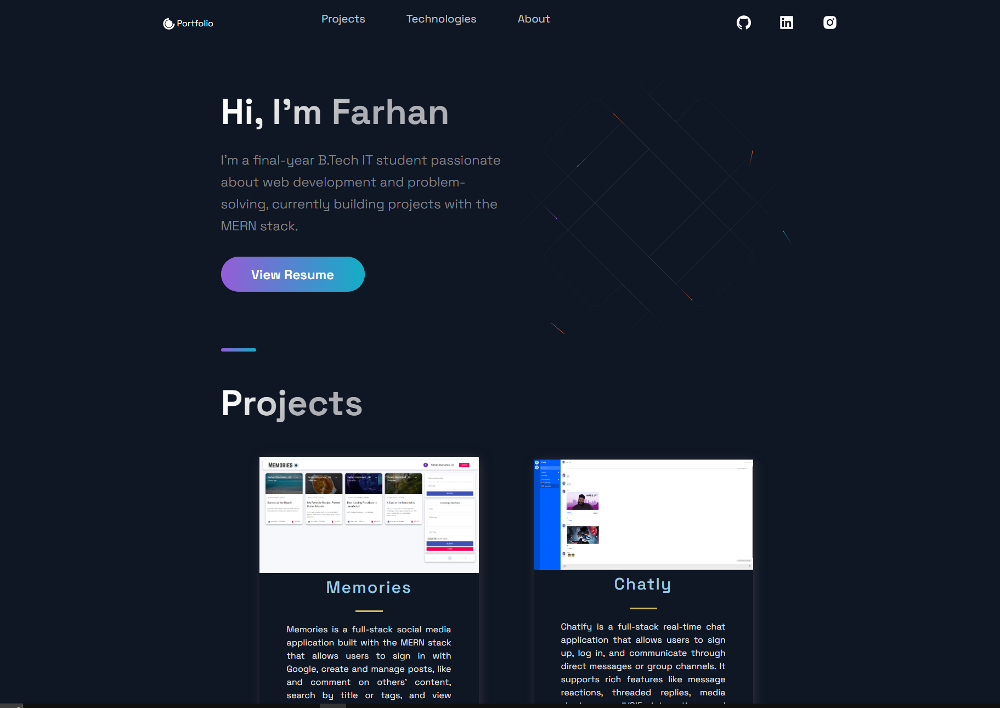
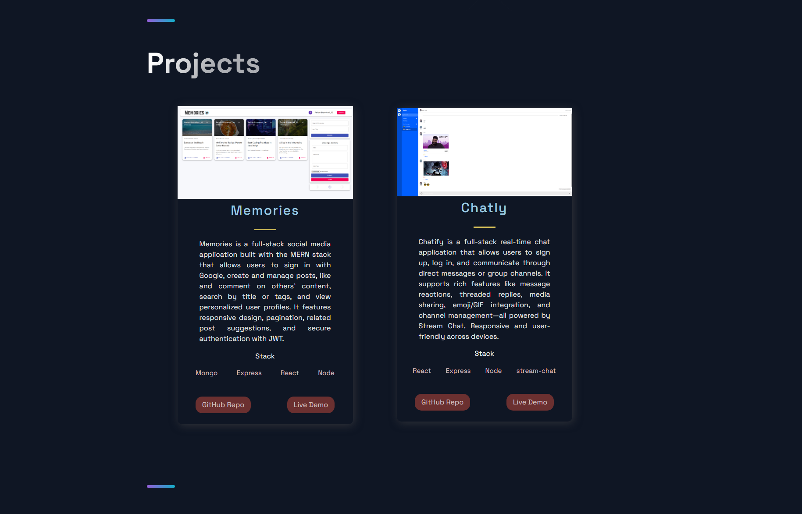
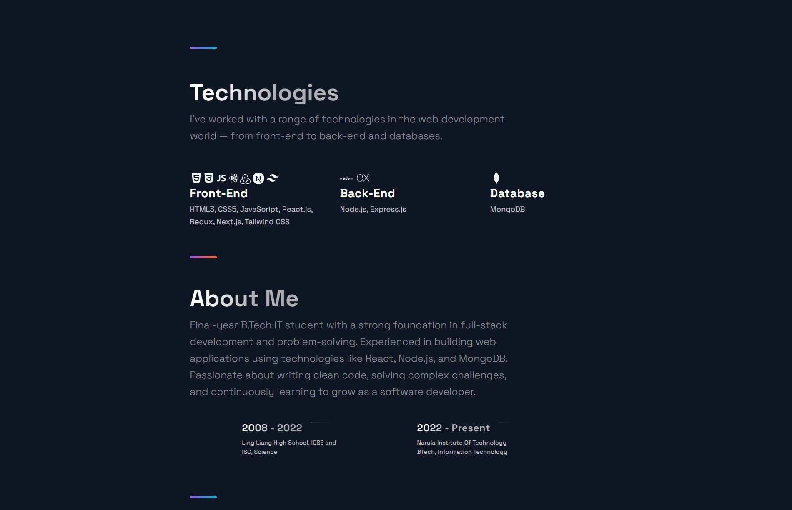

# 🚀 Personal Developer Portfolio

A modern and responsive developer portfolio built with **Next.js**, **Styled Components**, and **React Icons**, showcasing my skills, projects, and journey in web development.



---

## ✨ Features

- 📌 Hero section with name, summary, and social icons  
- 🧠 About Me section with timeline carousel  
- 🛠 Technologies section with categorized stacks and icons  
- 📱 Fully responsive design  
- 🌐 Deployed on Vercel  

---

## 🛠 Tech Stack

- Next.js  
- React  
- Styled Components  
- React Icons  

---

## 📁 Project Structure

```
├── components
│   ├── Header
│   ├── Hero
│   ├── Timeline
│   ├── Technologies
│   └── Footer
├── constants
│   └── index.js
├── pages
│   ├── _app.js
│   ├── _document.js
│   └── index.js
├── public
│   └── images/
├── styles
│   └── GlobalComponents/
└── README.md
```

---

## 🧰 Setup and Installation

```bash
# Clone the repository
git clone https://github.com/Farhan3112/Portfolio-NextJS.git
cd Portfolio-NextJS

# Install dependencies
npm install

# Run locally
npm run dev
```

---

## 🚀 Live Demo

🔗 [View Live Portfolio on Vercel](https://portfolio-farhan3112.vercel.app/)

---

## 📸 Screenshots

### ✅ Project Section


### ✅ Technologies and About Me Timeline


---

## 📄 License

This project is open-source and available under the [MIT License](LICENSE).

---

## 👨‍💻 Author

**Farhan Shamshad**  
[GitHub](https://github.com/Farhan3112)
